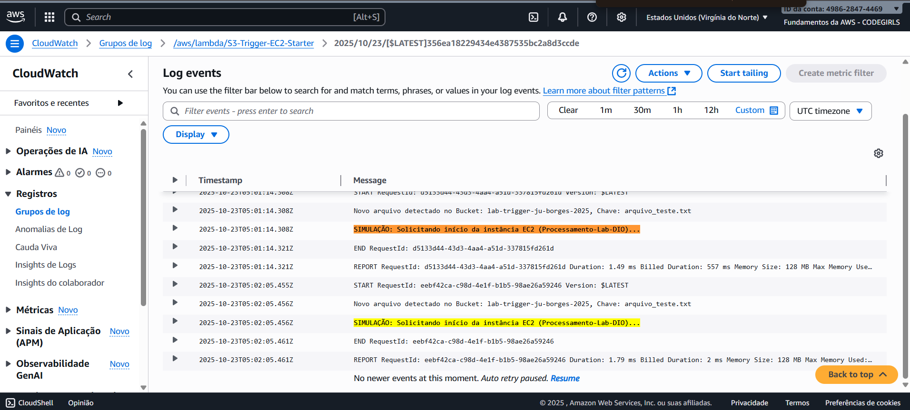
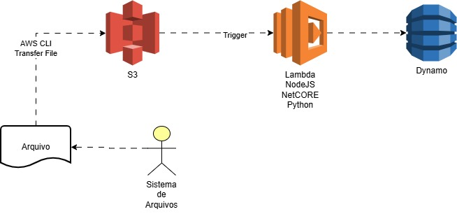

# ☁️ DIO Lab: Integração de Serviços AWS (S3, Lambda e EC2)

## 📄 Descrição do Projeto

Este repositório documenta o laboratório prático de integração de serviços AWS, simulando um fluxo de processamento de dados. O projeto foi estruturado para consolidar o conhecimento teórico e prático em **Infraestrutura (EC2), Armazenamento (S3) e Computação Serverless (Lambda)**, com foco em segurança IAM e automação CLI.

---

## 💡 Principais Insights e Aprendizados

### 1. Visão Holística de Serviços (IaaS vs. PaaS)

* **IaaS (EC2):** Proporciona controle total do S.O., ideal para processamento pesado.
* **PaaS/FaaS (Lambda):** Serviço gerenciado, perfeito para orquestrar o fluxo de dados.
* **Componentes EC2:** EBS, IP Elástico e Security Groups são vitais para a persistência e acesso seguro.

### 2. Fundamentos Essenciais da Segurança

* **IAM Roles:** Essenciais para autorizar a comunicação entre serviços (ex: Lambda para iniciar EC2).
* **Conta Root:** Restrição do uso apenas para tarefas críticas, com MFA obrigatório.

### 3. Gerenciamento e Automação

* **AWS CLI:** Utilizado para automatizar tarefas de IAM via linha de comando.
* **Ciclo de Vida EC2:** A distinção entre `Stop` e `Terminate` é crucial para a otimização de custos.
* **Monitoramento:** A importância do CloudWatch para a resiliência operacional.

---

## 4. Teste e Validação Final do Projeto

### 4.1 Método de Validação
O fluxo de trabalho foi validado via **Teste Manual Síncrono** na console Lambda, simulando o evento de upload do S3.

### 4.2 Prova de Execução (Sucesso)
O teste retornou **SUCESSO** no log do CloudWatch, provando que a **IAM Role** está configurada e a lógica de orquestração da Função Lambda foi executada com êxito.

---

## 🖼️ Visualização da Arquitetura

O diagrama de arquitetura, criado com o Draw.io, ilustra visualmente o fluxo de processamento de dados orientado a eventos do laboratório:

* **Fluxo:** `S3 (Trigger)` ➡️ `Lambda` ➡️ `DynamoDB`.

---

## 📚 Documentação Técnica Detalhada

O detalhamento das configurações, comandos e conceitos teóricos está organizado na pasta de documentos do projeto:

* [Conceitos Fundamentais da Cloud e Modelos de Serviço](docs/conceitos-cloud-base.md)
* [Segurança da Conta Root e Práticas IAM](docs/iam-security-root.md)
* [Gerenciamento de Identidades e Políticas IAM](docs/iam-identity-management.md)
* [Infraestrutura EC2, EBS, IP Elástico e Monitoramento](docs/ec2-iaas.md)
* [S3, Lambda e o Fluxo de Integração Serverless](docs/s3-lambda-integracao.md)
* [Comandos Essenciais: CLI, SSH e Configuração de Grupos](docs/automacao-cli-e-grupos.md)

---
